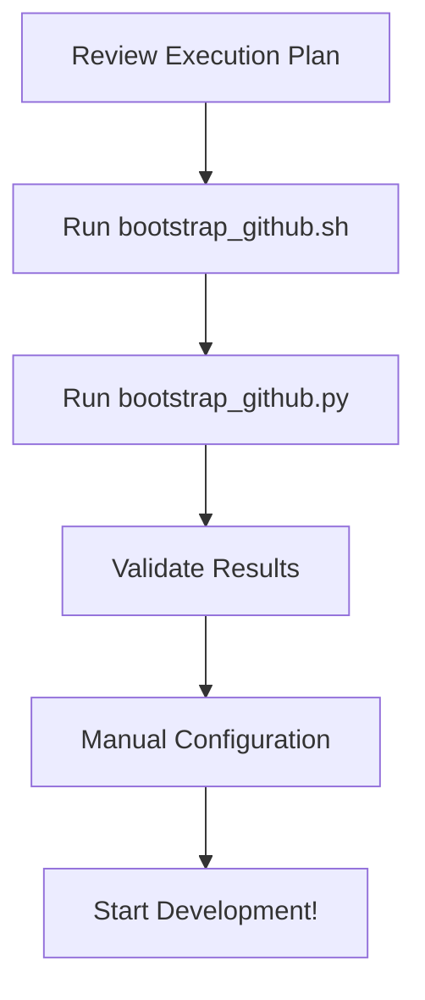

# PHASE 0: Notion → GitHub Migration

Welcome! This directory contains all planning artifacts and automation for bootstrapping GitHub project management from the Notion export.

## 📋 Quick Start

### For Repository Owners/Maintainers

If you want to execute the bootstrap and create all GitHub artifacts:

1. **Review the deliverables**: Read [`DELIVERABLES.md`](./DELIVERABLES.md) for complete overview
2. **Execute scripts**: Follow instructions in [`../scripts/planning/README.md`](../../scripts/planning/README.md)
3. **Validate results**: Use [`validation-checklist.md`](./validation-checklist.md)

### For Contributors

If you want to understand the project plan:

1. **Read execution plan**: Start with [`PHASE-0-notion-to-github-execution-plan.md`](./PHASE-0-notion-to-github-execution-plan.md)
2. **Browse Notion export**: Check [`../notion-export/`](../notion-export/) for source documentation
3. **Review issues**: Once created, issues will be at https://github.com/Abuzhor/smart-grocery-logistics-platform/issues

## 📁 What's in This Directory

| File | Purpose | Status |
|------|---------|--------|
| [**DELIVERABLES.md**](./DELIVERABLES.md) | Summary of all deliverables with metrics | ✅ Complete |
| [**PHASE-0-notion-to-github-execution-plan.md**](./PHASE-0-notion-to-github-execution-plan.md) | Master execution plan with 40 issue mappings | ✅ Complete |
| [**validation-checklist.md**](./validation-checklist.md) | Step-by-step validation checklist | ✅ Ready |
| **README.md** (this file) | You are here! | ✅ |

## 🚀 Execution Flow



### Step-by-Step

1. **Review** - Read the execution plan to understand what will be created
2. **Execute** - Run the bootstrap scripts to create labels, milestones, issues, and project
3. **Validate** - Verify everything was created correctly
4. **Configure** - Manually set up project views and workflows
5. **Develop** - Start working on issues!

## 📊 What Gets Created

### Labels (31 total)
- **Phase labels** (5): Track which phase of development
- **Domain labels** (10): Categorize by technical domain
- **Type labels** (7): Distinguish documentation, features, infrastructure, etc.
- **Priority labels** (4): Set urgency (critical → low)
- **Category labels** (5): Business category (grocery, cold-chain, etc.)
- **Gate labels** (4): Decision gate criteria

### Milestones (5 total)
- **PHASE 0**: Bootstrap & Planning (+30 days)
- **PHASE 1**: Foundation (+90 days)
- **PHASE 2**: MVP Launch (+180 days)
- **PHASE 3**: Scale & Optimize (+270 days)
- **PHASE 4**: Global Expansion (+365 days)

### Issues (40 total)
Mapped from Notion export documentation:
- 1 meta issue for PHASE 0 tracking
- 9 PHASE 0 issues (bootstrap & planning)
- 8 PHASE 1 issues (foundation)
- 7 PHASE 2 issues (MVP launch)
- 5 PHASE 3 issues (scaling)
- 6 PHASE 4 issues (global expansion)
- 4 cross-cutting issues

### Project Board (1 total)
- **Name**: "Smart Grocery Logistics Platform - Execution Board"
- **Columns**: Backlog → Ready → In Progress → Review → Blocked → Done
- **Custom Fields**: Phase, Domain, Priority, Notion Reference

## 🔗 Traceability

Every issue includes:
- ✅ **Direct links** to source Notion export files
- ✅ **KPI references** to metrics and measurement dictionary
- ✅ **Acceptance criteria** for completion
- ✅ **Cross-references** to related issues

Example traceability:
```
Issue #25: Launch Pilot in City 1
  ↓
References: docs/notion-export/08-90-day-city-launch-plan.md
  ↓
KPIs: On-time delivery ≥95%, Payment success ≥99%
  ↓
Links to: docs/notion-export/07-metrics-and-gates.md#L3-L6
  ↓
Related to: Issues #3, #5, #19, #20, #21
```

## 🛠️ Scripts Location

All automation scripts are in [`../../scripts/planning/`](../../scripts/planning/):
- `bootstrap_github.sh` - Creates labels, milestones, issues
- `bootstrap_github.py` - Creates Projects v2 board
- `config.json` - Configuration data
- `README.md` - Detailed usage instructions

## ✅ Success Criteria

This PHASE 0 is successful when:
1. All labels created (31 total)
2. All milestones created (5 total)
3. All issues created (40 total)
4. Project board created and configured
5. All issues added to project
6. Full traceability verified
7. Validation checklist completed

Current Status: **READY FOR EXECUTION** ✅

## 📚 Source Documentation

All issues are derived from the Notion export in [`../notion-export/`](../notion-export/):
- Executive summary and vision
- Platform scope and categories
- 90-day city launch plan
- Metrics and gates
- Technology principles
- Operations governance
- Economics and revenue model
- And more...

## 🤝 How to Contribute

1. Review the execution plan to understand the work breakdown
2. Check issue status on the project board
3. Pick an issue from "Ready" column
4. Move it to "In Progress" and assign yourself
5. Create a branch: `feature/issue-{number}-brief-description`
6. Work on the issue following acceptance criteria
7. Submit PR and request review
8. Move to "Review" column

## 📞 Need Help?

- **Execution questions**: See [validation-checklist.md](./validation-checklist.md)
- **Script issues**: Check [scripts/planning/README.md](../../scripts/planning/README.md)
- **Planning questions**: Review [PHASE-0-notion-to-github-execution-plan.md](./PHASE-0-notion-to-github-execution-plan.md)
- **General questions**: Open a GitHub discussion or issue

## 📅 Timeline

- **PHASE 0**: Bootstrap & Planning - 30 days
  - Week 1-2: Review and execute bootstrap
  - Week 3-4: Complete planning documentation

- **PHASE 1**: Foundation - 90 days
  - Build core platform architecture
  - Implement basic modules

- **PHASE 2**: MVP Launch - 180 days
  - Single-city pilot with 2 categories
  - End-to-end workflows

- **PHASE 3**: Scale & Optimize - 270 days
  - Expand to 5-7 categories
  - Launch second city

- **PHASE 4**: Global Expansion - 365 days
  - Multi-country expansion
  - Full compliance framework

## 🎯 Next Actions

**For Repository Owner:**
1. Review all files in this PR branch (`phase-0-notion-to-github`)
2. Execute bootstrap scripts (requires GitHub authentication)
3. Validate results using validation checklist
4. Merge to `main` branch
5. Announce to team that project board is ready

**For Team Members:**
1. Wait for bootstrap execution
2. Review project board when ready
3. Familiarize with execution plan
4. Begin picking up issues from "Ready" column

---

**Created**: 2026-01-08  
**Branch**: `phase-0-notion-to-github`  
**Status**: Complete and ready for execution  
**Next**: Execute scripts → Validate → Merge to main
